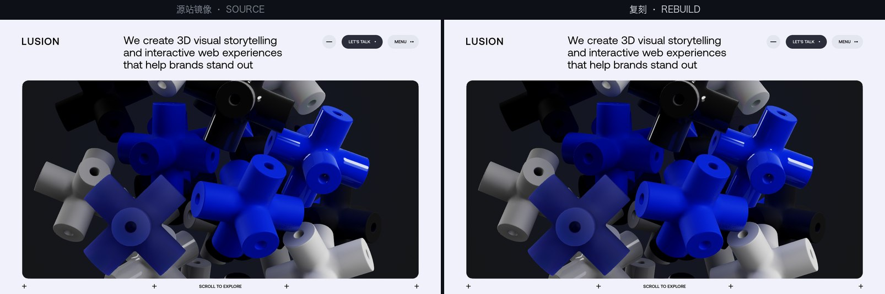
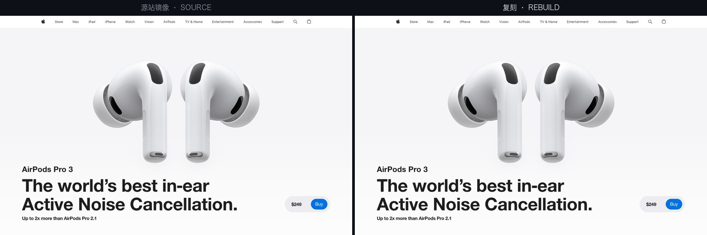
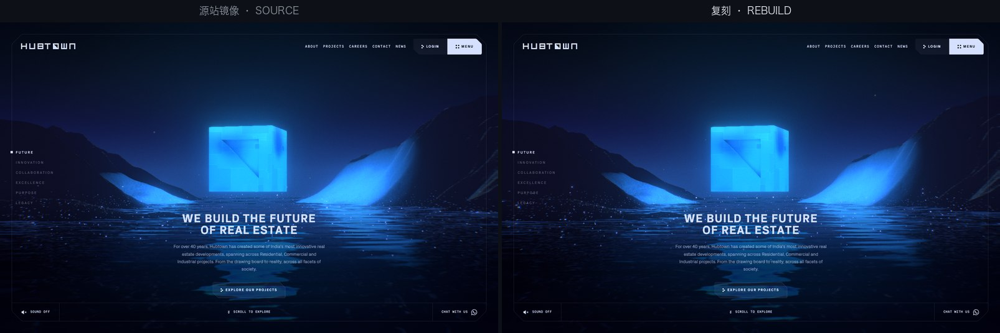
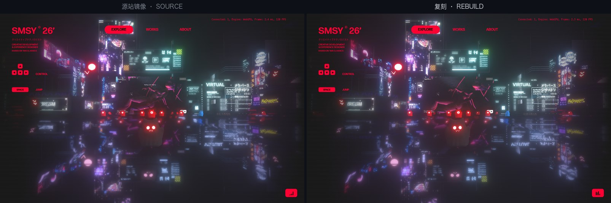
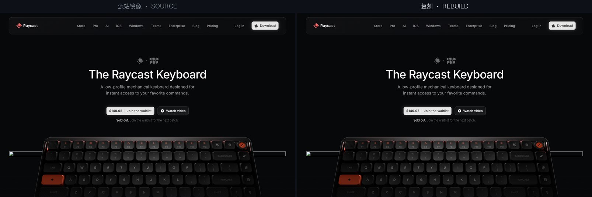

# website-rebuild-skill

<a href="https://trendshift.io/repositories/128679" target="_blank"></a>
<a href="https://trendshift.io/repositories/128679" target="_blank"></a>

[](LICENSE)
[](https://www.npmjs.com/package/website-rebuild-skill)
[](https://agentskills.io/)
[](#quick-start)

[中文](README.md) | **English**

Give your AI agent a URL and it rebuilds that website **line by line** — and can **prove** the rebuild is correct.

This is not "make a page that looks similar." The skill treats the source site's implementation as the spec sheet: it first captures the whole site as read-only evidence, then reconstructs the logic line by line from the minified code, and finally proves "the rebuild and the source site are doing the same thing" with a battery of automated acceptance gates — including pixel-by-pixel comparison.

It follows the [Agent Skills open standard](https://agentskills.io/) and is built for **any skills-capable agent**. Cross-runtime is measured, not claimed: the verification list includes targets completed by Claude Code **and one completed end-to-end by Codex** (Hashgraph VC, 166/166 response bytes identical) — the same skill directory runs the full pipeline in whichever runtime you drop it into.

## Table of contents

- [Features](#features)
- [Side by side: source vs rebuild](#side-by-side-source-vs-rebuild)
- [Quick start](#quick-start)
- [How it works](#how-it-works)
- [Scope](#scope)
- [How this differs from site scraping](#how-this-differs-from-site-scraping)
- [Verified sites](#verified-sites)
- [Repository layout](#repository-layout)
- [On copyright](#on-copyright-what-you-can-build-and-what-you-should-publish-are-different-questions)
- [Roadmap](#roadmap)
- [Changelog](#changelog)
- [Contributing](#contributing)
- [License](#license)
- [Links](#links)

## Features

- **Triage first** — before starting, it probes what class the target belongs to and whether it can be done; if not, it says why instead of grinding out garbage
- **Forensic mirroring** — the whole site becomes a read-only snapshot (per-file sha256 ledger, reference-closure checks, authenticity checks) that runs fully offline
- **Line-traceable reverse engineering** — every line in the rebuild points back to a line in the source bundle; bugs and oddities are copied verbatim, never "fixed"
- **Quantified acceptance** — five automated comparison layers: console / network / DOM / geometry / **pixel-by-pixel**; every difference is either fixed or registered, never glossed over
- **Source-form delivery** — the verbatim port is rewritten into a human-readable project (split into modules, named from evidence, provenance headers added) that **runs offline anywhere you copy it**
- **Zero-dependency toolchain** — 75 Node scripts (51 stage scripts and gates + 14 shared libs + 10 sourcification/reconstruction tools); until the final stage, the pipeline installs no npm packages
- **Dead sites can be rescued** — Wayback archive salvage: anchor + time-window selection of a coherent moment, raw bytes landed as a standard mirror, permanent holes honestly registered; five dead-site salvages in practice (four revived, one to full L3; one art layer certifiably lost — the failure mode is in the book)
- **Even RSC sites can be reconstructed** — server component source is never shipped (React Server Components / Next.js App Router), but its complete output (the flight stream) inlined in every page's HTML *is* the spec: reconstruct a buildable Next project from it and close with flight-semantics gates. Measured on a Next 16/Turbopack blog: 18/18 routes semantically identical, and on a 144-route heavyweight: PASS 144/144; blind reverse-engineering graded against the public source scored ≈95% structure / ≈98% behavior
- **Legal decisions belong to the user** — the skill only collects evidence and presents it; output defaults to private + noindex + not deployed

## Side by side: source vs rebuild

In each image the **left half is the read-only mirror of the source site, the right half is the rebuild**, taken from each project's acceptance runs: same viewport, same scroll position, same animation instant. Except where noted, the frames shown are **pixel-identical** (meanAbsDiff 0.00).


**[lusion.co](https://lusion.co/)** — 1.25 MB custom WebGL engine + 156 shaders. The 3D pile's pose comes from a physics simulation; with the simulation state pinned, both sides are pixel-identical.


**[apple.com/airpods-pro](https://www.apple.com/airpods-pro/)** — 565 webpack modules ported verbatim, 9 scroll checkpoints pixel-identical; this is the hero.


**[hubtown.co.in](https://hubtown.co.in/)** — full-screen WebGL long take driven by Theatre.js (Nuxt 3 + three.js). Live-rendered frames; the pixel difference falls inside the same-side noise band (meanAbsDiff 0.96).


**[samsy.ninja](https://samsy.ninja/)** — cyberpunk WebGPU real-time scene, 238 MB of assets. Both sides render the same instant live; the film grain belongs to the scene itself.


**[www.on.energy](https://www.on.energy/)** — Nuxt 3 + WebGL GLB scene + Storyblok headless CMS. With the hero video pinned to the same frame on both sides, pixel-identical.


**[raycast.com/keyboard](https://www.raycast.com/keyboard)** — triage to sourcification in a single session. Note the unloaded lazy-image placeholder strip above the keyboard: **identical on both sides** — bugs and odd states are copied, not fixed. That is discipline #4 at work.

## Quick start

### Prerequisites

| Dependency | Version / notes |
|---|---|
| Node.js | ≥ 22 (built-in fetch / WebSocket, direct CDP) |
| Chrome / Chromium | installed locally, used for headless comparison |
| `npx` | a few stages spawn version-pinned external tools (never import them) |

### Install

Either way installs the same directory.

**Option 1 — npx (one command, no clone needed)**

```bash
npx website-rebuild-skill                      # -> ~/.claude/skills/website-rebuild
npx website-rebuild-skill --project            # -> ./.claude/skills/website-rebuild
npx website-rebuild-skill --dir <skills dir>   # other runtimes; `website-rebuild` is appended
```

The installer **only copies files** — it never runs the skill, never opens a browser, never fetches anything, and has no dependencies of its own. Every copied file is verified against the source by sha256 before it reports success; an existing install is reported by version and left alone unless you pass `--force`. Use `--dry-run` to see what it would write.

**Option 2 — copy by hand (you already cloned the repo)**

Put the entire `skills/website-rebuild/` directory into your agent's skills directory. For Claude Code:

```bash
# user level (or project level .claude/skills/)
cp -R skills/website-rebuild ~/.claude/skills/website-rebuild
```

For other runtimes that support the Agent Skills standard, place the same directory according to their conventions.

### Use

Give your agent a URL and say "rebuild this site" or "1:1 rebuild this website."

**It will come back to you with questions**: the rebuild scope (whole site or specific pages), **which level to stop at** (L1 mirror archive / L2 engineered rebuild / L3 source-form — the ladder is monotone, choosing low costs nothing, you can resume and upgrade any time), how to handle external dependencies, and every judgment that touches "can this be published." Those are **your decisions**; the agent will not make them for you.

**How long it takes**: turnaround has converged version over version — early projects took weeks; today a small-to-mid site (a few dozen routes) runs **unattended in a single session** from triage to sourcification, while heavy WebGL / custom-engine sites take about 1–3 days. The agent gives a difficulty rating and an estimate before starting.

## How it works

You give it a URL; the agent walks the chain on its own:

| Stage | What it does | What you see |
|---|---|---|
| **Triage** | Probes what class the site is and whether it can be done | A verdict with reasons; if it can't be done it says why — **no grinding out garbage**; vanished sites with archives divert to Wayback salvage |
| **Forensic mirror** | Captures the whole site as a read-only snapshot that runs offline | A per-file checksummed mirror and its ledger |
| **Reverse engineering** | Unfolds the minified code so every line of the rebuild can point back to the source | Reverse-engineering notes explaining how the site is built |
| **Port** | Restores the logic line by line into your own project, every change annotated with provenance | A runnable rebuild + an itemized deviation ledger |
| **Acceptance** | Automated comparison of both sides: console, network, DOM, geometry, pixels | A quantified report; every difference is fixed or registered, **never glossed over** |
| **Closeout** | Audits module by module for gaps and organizes the copyright facts | An audit record + a deployment assessment awaiting your ruling |
| **Sourcification** | Turns the verbatim port into a human-readable project: modules split, variables named, comments added, assets copied (bundle-less artifacts go through **concatenative decomposition** — cut into semantically named parts that reassemble byte-identical) | A source project that **runs standalone anywhere you copy it**, self-verifying its bytes file-by-file on every start |

**It cares about "correct", not "similar".** One custom-WebGL-engine rebuild reached **cross-side pixel identity** on three routes (`meanAbsDiff 0.00`) and shipped as 389 source modules with a median of 18 lines; a 449k-line Nuxt/Vite site decomposed into 2,043 semantically named parts, grouped by domain into scene/camera/wave directories, and **reassembles byte-identical**.

⭐ **The last step is sourcification, and it must come last.** The scariest part of refactoring is not knowing whether you broke something; here a pixel-exact referee exists *before* the work starts, so every split and every rename can be proven safe. **Refactoring without a referee is blind editing.**

⭐ **This is also where the skill ends: at "truth a human can read."** Taking the output further — scaffolding, forking, derivative work — is **your project, not its stage**: it won't pick names, write stories, or swap content for you, because only you can make those calls. But it leaves you something nowhere else provides: the deliverable's own byte manifest and reassembly gate, so after you fork you know **precisely how each step diverges from the source site**. See the handover guide: [`beyond-the-rebuild.md`](skills/website-rebuild/references/beyond-the-rebuild.md).

### The six disciplines

These are not style preferences. Each was learned by collision, and violating any of them comes back as bugs later:

1. **The mirror is read-only**, forever — it is the project's only evidence baseline
2. **Source code is the only arbiter** — never tune effects by eye
3. **Everything the source has, you have; nothing the source lacks, you invent** — better temporarily unlike than self-patched
4. **Bugs, dead code, and odd idioms are copied verbatim** — any oddity in minified code may be the behavior itself
5. **Intentional deviations must be registered** — "what the source does / what we do / why"; **an unregistered deviation is a bug by definition**
6. **Code and docs land in the same commit**

⚠ Discipline #3 has one explicit boundary in the final **sourcification** stage: renaming, splitting, and commenting in the human-written copy **does not count as "inventing"** — that copy is an explicitly registered derivative, not a claim about the source. Two hard lines stay: **no opportunistic refactoring** (merging duplicates, extracting helpers, changing algorithms all make "equivalent" undecidable), and **speculation in comments must be labeled as speculation**.

## Scope

### Proven scenarios (classes A / B)

| Scenario | Coverage | Measured scale |
|---|---|---|
| **Imperative WebGL / Canvas scenes** | three.js, custom engines, verbatim GLSL/TSL extraction | 1.25 MB single bundle + 156 shaders; another site: 47,224 lines of three-based engine |
| **GSAP timelines / scroll storytelling** | timelines, ScrollTrigger, custom input state machines | several award-winning portfolio sites |
| **Baked animation & proprietary binary formats** | GLB / `.buf` / `.riv` / KTX2, decoded into verifiable numbers | 53 geometry files, 170,289 vertices, format reverse-engineered from code |
| **Static-builder output** | Astro / Nuxt SSG / Webflow export shells / Vite / webpack | single-page, SSG, and export-shell sites |
| **All code shapes** | minified, obfuscated, unobfuscated | fully obfuscated 47k lines; unobfuscated 974 lines; sites with no bundle at all, logic living in inline template blocks |
| **Multilingual / RTL sites** | paired bilingual route reconciliation, `dir=rtl` layout, PJAX transitions | an en/ar site with 122 routes (first RTL sample) |
| **Audio-behavior sites** | sound as an acceptance surface: audio-pool census (all loaded, zero audio 404s, zero external calls), "the pool is the ledger" capture for runtime-assembled URLs | a game-audio studio site with a 98-sound pool (theme music + per-control interaction sounds, dual-encoded) |
| **Class B: platform-layer separation** | Shopify (platform / apps / upstream theme / site-specific code as four layers) | two Shopify stores, one a theme-fork custom shop |
| **Class B: third-party asset buckets / headless CMS** | Storyblok (`/m/` transform endpoints), full Strapi upload-bucket mirroring | a ~1,800-image CMS bucket + an 864 MB Strapi bucket |
| **Class B: serialized data-blob expansion** | Nuxt-style SSG data encoded into the page | a 63.5 KB blob (54% of the document) expanded to 566 KB of structured data, compared item by item |
| **Class X: dead-site archive salvage** | Wayback CDX enumeration → anchor + time-window coherent capture → `id_` raw bytes → standard mirror; permanent holes honestly registered, alias backfills listed, parked-page autopsy blocks 200-type body-snatching | five salvages, five shapes: domain takeover (8/15 routes), platform reclamation (9/9 clean), in-place parking replacement (0 holes, 0/0/0), DNS death + parking body-snatch (first-launch, full L3), manifest-driven art layer wholly unarchived (mustachelab — engine rescued, failure mode recorded) |
| **Class C2: declaratively organized modern full-stack sites** | Next.js App Router (webpack / Turbopack), Nuxt 3 + Vite, R3F, Theatre.js — RSC flight and devalue payloads, server image endpoints, session-state prefetch, and compiled components embedded via verbatim graphs (transcribed micro-runtime) all handled | seven C2 targets: a 115-route full site (115/115 cross-side identical), a Three r182 WebGPU/TSL site, a Theatre.js WebGL long-take site, a product page (4 checkpoints pixel-zero), a heavy-WebGL studio site (C1+C2 hybrid, 144 routes), and more |

### Conditional or out of scope

| Class | Type | Why |
|---|---|---|
| **C1** | Server-component sites (RSC / Next.js App Router) | Server component source is never shipped, but its complete output (the flight stream) inlined in every page *is* the spec. ⭐ **Doable since v0.3: reconstructive reverse engineering** — build a compilable Next project, closed by flight-semantics gates (measured: rauchg.com 18/18 and basement.studio 144/144 routes identical). No verbatim port; the deliverable is "human-written source + gate-proven equivalence" |
| **D** | Server-behavior sites | The behavior lives server-side (CMS, inventory, A/B bucketing, personalization); **there is no portable client-side target** and no deterministic acceptance baseline |
| **X (no archive)** | Vanished sites without Wayback coverage | Nothing left to mirror. ⭐ **Archived X sites can be salvaged** (see above); measured disappearance rate among past award-winning sites is about **29%** — which is why "mirror first, immediately" is discipline #1 |

Measured samples for each class: [Verified sites](#verified-sites).

## How this differs from site scraping

wget, HTTrack, SingleFile and the like can pull a site to disk; it opens and runs offline. **If all you want is an archive or a local copy, use those — you don't need this.**

The difference: **scraping answers "what does it look like"; rebuilding answers "how is it done".**

| | Scraping / mirroring | Engineered rebuild |
|---|---|---|
| **The JS you get** | Minified, obfuscated output; hundreds of thousands of characters per line | **A module tree**: 389 files, median 18 lines, each header pointing back to its source lines |
| **Variable names** | `e`, `t`, `r` — what the minifier erased is gone | **Restored one by one where evidence allows**; ⛔ **no evidence, no rename** — a wrong name is worse than `e` |
| **Third-party libraries** | Fused into the same file as app code | **Separated out** and reinstalled from npm at the version the source declares (extracted from code as evidence, never guessed) |
| **Can you modify it** | Yes, but you don't know what changed or what broke | Yes, and **a full automated suite tells you whether you broke anything** |
| **How do you know it's right** | Open it, squint, looks close | Console / network / DOM / geometry / **pixel** — five automated layers; every difference fixed or registered |
| **Do you learn anything** | No — you never read a single line | The output includes **reverse-engineering notes**: how the animations are orchestrated, how the scene is organized, how the data was baked |
| **Can you take it with you** | Yes, but it's just those files | **Copy anywhere, install offline, run** — assets, build config, dev server included |
| **Typical deliverable** | A pile of files | A runnable project + reverse-engineering notes + deviation ledger + acceptance report + copyright assessment |

**The mirror is where this pipeline starts, not where it ends.** Step one still captures the whole site as a read-only snapshot — but here the snapshot's job is to **be the referee**: every later judgment of "is the rebuild right" is measured against it. Scraping stops there; rebuilding starts there.

## Verified sites

### Fully rebuilt

The origin and proving ground of the methodology — every entry in the [changelog](CHANGELOG.md) comes from one of these projects.

| Site | URL | One-liner |
|---|---|---|
| Rogier de Boeve | [rogierdeboeve.com](https://rogierdeboeve.com/) | Photographer portfolio, GLB models + scroll storytelling; the methodology's first prototype |
| ORYZO | [oryzo.ai](https://oryzo.ai/) | Product site with a custom WebGL scene; mobile texture naming rules had to be reverse-engineered, not guessed |
| Samsy | [samsy.ninja](https://samsy.ninja/) | Creative developer portfolio, 238 MB of assets; established "the mirror is the only asset store, never copy twice" |
| Kimi Careers | [careers.kimi.com](https://careers.kimi.com/) | Recruiting site; the five reasons to refuse "optimizing" a 4.8 MB Chinese bitmap font became the template for deviation registration |
| Noomo Storytelling | [storytelling.noomoagency.com](https://storytelling.noomoagency.com/) | Nuxt SSR + GLB baked scroll storytelling; established byte-level comparison of server-rendered output |
| Lando Norris | [landonorris.com](https://landonorris.com/) | Driver site with assets scattered across external CDNs; established unified consolidation of external resources |
| Racing.shop | [racing.shop](https://racing.shop/) | First real-world project, a Shopify store; spawned the platform-layer separation guide and streaming-media recapture |
| Shopify Editions Design | [shopify.design](https://shopify.design/) | 47,224-line imperative three.js engine on a single page; the hardest reverse-engineering in the series |
| Object & Archive | [objectandarchive.com](https://objectandarchive.com/) | Shopify theme-fork custom store, logic living in inline template blocks; spawned the "no bundle" branch and the copyright forensics flow |
| AIM Services 50th | [aimservices.co.jp/50th](https://www.aimservices.co.jp/50th/) | Japanese corporate anniversary microsite; the first target run **fully unattended** |
| ChungiYoo | [chungiyoo.com](https://chungiyoo.com/) | Designer portfolio, Nuxt 2 SSG; the in-page data blob is 54% of the document and inflates 8.9× when expanded |
| Apple AirPods Pro | [apple.com/airpods-pro](https://www.apple.com/airpods-pro/) | The triage benchmark species and first webpack module-container target; 565 modules ported verbatim, **9 scroll checkpoints pixel-identical**, offline rebuild outside the repo still 0.00 |
| Optimus (v0-generated) | [v0-optimus-delta.vercel.app](https://v0-optimus-delta.vercel.app/) | Next.js + **Turbopack** container, the second bundler shape; ⭐ bundler-preserved export names turned naming from inference into transcription (16/20 tier-1) |
| Lusion | [lusion.co](https://lusion.co/) | Creative studio site, 1.25 MB custom WebGL engine + 156 shaders; three routes **pixel-identical**, full **sourcification** — 389 modules, runs standalone anywhere |
| EIGHT DESIGN | [eightdesign.co.jp](https://eightdesign.co.jp/) | Japanese design firm, **115-route full site** (Next.js App Router + Turbopack), first C2 target; 278 modules ported verbatim, **115/115 routes render identically cross-side** |
| Raycast Keyboard | [raycast.com/keyboard](https://www.raycast.com/keyboard) | Raycast × NuPhy product page (Turbopack + DRACO 3D models); triage to sourcification **in a single session**; re-audited and brought up under v0.3.15: 13 lazy chunks + the 42-rung next/image ladder (browser-Accept ledger tree) + 51 MB of prefetch-payload images into the mirror, 61 chunks / 879 modules token gate 61/61, state-aligned pixel gate 4+4 self-bands ≤0.11, cross-side 5 checkpoints ≤0.01 |
| Hubtown | [hubtown.co.in](https://hubtown.co.in/) | Unseen Studio's full-screen WebGL long take (Nuxt 3 + three.js + **Theatre.js**), the C2 exemplar of licensed animation state shipped in the bundle; landing pixel diff inside the same-side noise band |
| ON.energy | [www.on.energy](https://www.on.energy/) | Energy company site (Nuxt 3 + WebGL GLB scene + **Storyblok headless CMS**), first full CMS asset-bucket mirror (~1,800 images); 55/55 routes error-free, hero video pixel-zero once frame-pinned |
| Milk Network | [milknetwork.com](https://milknetwork.com/) | Saudi brand agency site (webpack + GSAP + **Strapi CMS bucket**), first **bilingual RTL** site (en/ar, 122 paired routes); all 15 main modules sourcified and delivered in chunk form, animation end-state pixel-exact zero |
| Hashgraph VC | [hashgraphvc.com](https://hashgraphvc.com/) | VC site (Nuxt 3 + Three r182 **WebGPU/TSL** + Sanity CMS), ⭐ **first rebuild executed end-to-end by a non-Claude runtime (Codex)** — 166/166 response bytes identical; also the birthplace of **concatenative decomposition**: 449k lines cut into 2,043 semantically named parts, byte-identical on reassembly |
| Overworld Audio | [overworldaudio.com](https://overworldaudio.com/) | Game-audio studio site (Nuxt 3 + THREE/Theatre + **Howler**), ⭐ **sound became an acceptance surface for the first time** — 98/98 sound pool fully loaded, zero audio 404s; birthplace of "the pool is the ledger" capture |
| Guillermo Rauch's blog | [rauchg.com](https://rauchg.com/) | ⭐ **First C1 (RSC) reconstructive reverse engineering** — a buildable Next project reconstructed from the flight stream, **18/18 routes pass the semantics gate**; also the birthplace of **blind reverse-engineering graded against the answer key**: ≈95% structure, ≈98% behavior, 7 dependency versions pinned exactly from byte evidence |
| basement.studio | [basement.studio](https://basement.studio/) | Heavy-WebGL design studio site (Next 16.3 + React 19 streaming + three/R3F + Sanity), a C1+C2 hybrid week-scale campaign, **functionally closed out**: flight semantics gate **PASS 144/144**, module bijection 50 pairs zero violations; the 3D office scene, a 16.5k-line ScreenUI arcade engine, two offscreen workers, and the mux/tweet lazy families all run inside the rebuilt project via **verbatim graphs + a transcribed micro-runtime** (birthplace of v0.3.7's fourth delivery form), 12-route sweep 10 CLEAN |
| First Launch 七點半的太空人 | — (gone) | ⭐ **First class-X dead site taken through the full L3 pipeline** — a 2013 Awwwards site (jQuery + skrollr scroll narrative) rebuilt from a Wayback anchor at 2015-01: 27 permanent holes honestly registered, numeric gate **9,856 samples identical**, pixels exact-zero at 7/9 checkpoints, self-contained deliverable runs offline |
| Lama Lama | [lamalama.com](https://lamalama.com/) | Amsterdam creative agency (WordPress shell + Vite scope-hoisted bundle + 2.4 GB of Bunny HLS); the first target where the pixel gate had to **wait for media arrival** — the `autoplay` attribute bypasses a `play()` patch, the first HLS fragment's PTS leaves a hole at 0, hls.js's stall detection fights a faked `paused` — which is where single-source protocol expressions and instrument fingerprints come from; 9 routes × 5 checkpoints cross-side at 0.00 |

### Boundary samples and dead-site salvage

Representatives from 43 probed sites that drew the boundary — **the boundary is measured, not declared**; five dead-site salvages measured: four revived (three at L1; first-launch through the full L3 pipeline, see above), one with its engine rescued and its art certifiably lost — **failure modes go in the book too**.

| Site | URL | Class | One-liner |
|---|---|---|---|
| Linear | [linear.app](https://linear.app/) | **C1** | Server component source not shipped; reconstructive reverse engineering applies since v0.3 (the flight stream is the spec) |
| Duolingo | [duolingo.com](https://www.duolingo.com/) | **C1** | Same — the RSC stream ships no source, but the inlined flight output can be reconstructed against |
| TechCrunch | [techcrunch.com](https://techcrunch.com/) | **D** | WordPress content site; the behavior lives server-side |
| Airbnb | [airbnb.com](https://www.airbnb.com/) | **D** | Personalization + server-side data; no deterministic acceptance baseline |
| darknetflix.io | — | **X→salvaged** | Domain takeover; ⭐ recovered from Wayback (anchor 2020-07, 8/15 routes revived, 92 permanent holes honestly registered) |
| umamiland | — | **X→salvaged** | Platform reclamation; ⭐ recovered from Wayback (**sweep 9/9 routes clean**, probe→seed iterative convergence) |
| jiouhe.com | — | **X→salvaged** | Replaced in place (domain alive, serving a parking page); ⭐ recovered at anchor 2018, **0 permanent holes, 0/0/0**, scroll-wheel frame animation fully revived — birthplace of the parked-page autopsy and typo-twin normalization |
| Merlin's Mustache LAB | — (gone) | **X→engine rescued, art certifiably lost** | ⭐ Names the second class-X failure mode: **a complete mirror that cannot revive the site** — code layer 100% (manifest-driven circuit-board engine, CreateJS-as-loader + Swiffy, fully readable), art layer 157/160 assets never captured by any archive (IA does not execute JS); all 157 holes derived line-by-line and registered, stopped at L1 + engine docs |

## Repository layout

```
skills/website-rebuild/    # the skill itself, laid out per the agentskills.io standard
├── SKILL.md               #   main pipeline + triage + disciplines (loaded whole on activation)
├── references/            #   23 scenario guides (loaded on demand)
│   └── case-studies/      #     the evidence behind each doc's rules; never in a mandatory set
├── assets/templates/      #   document templates
├── scripts/               #   zero-dependency Node stage scripts and gates + lib/ shared modules
│                          #     every stage before sourcification lives here
└── tools/                 #   sourcification-stage reconstruction tools; devDependencies allowed
selftest/                  # repo self-tests: npm test (offline) + npm run test:browser (real Chrome); not distributed with the skill
.github/workflows/         # CI: both lanes on push/PR; a tag publishes to npm
CHANGELOG.md               # changelog
README.md                  # Chinese README
README.en.md               # this file
```

⭐ **The boundary between the two directories is a stage, not a role**: everything before sourcification is **zero-dependency** — a rebuild project installs nothing until the last step. When an earlier stage needs a real parser, it `spawn`s a version-pinned npx tool (`js-beautify` / `acorn`); the script itself stays dependency-free and independently auditable. `scripts/verify-zerodep.mjs` enforces this line, because it once **lived only in the docs and was violated for eight versions unnoticed**.

## On copyright: what you can build, and what you should publish, are different questions

This skill is for **study and research**. Output defaults to **private + noindex + not deployed** — a **conservative default action**, not a legal conclusion the agent draws for you.

Before anything goes public, per-asset copyright **forensics** must be completed, and **the decision is always yours**: the skill only gathers facts, lays out options with their risk boundaries, and makes recommendations; anything touching "publish / deploy / redistribute" is explicitly handed back to you.

⛔ One hard rule is written into the skill: **legal caution must never reduce the completeness of the mirror**. One run once skipped ~60% of assets on the grounds of "we're not publishing anyway" — while every acceptance gate showed green. Since then, "don't capture" is only ever allowed for technical reasons.

## Roadmap

- **v0.3 landed**: C1 (RSC) reconstructive reverse engineering — the flight coordinate system (flight-decode), the semantics gate (verify-flight, global module-id bijection), the body reconstructor (flight-to-mdx), the runtime gap reconciler (reconcile-gaps), and the `rsc-reconstruction.md` guide; measured on rauchg.com, 18/18 routes semantically identical, blind reverse-engineering graded against the answer key. The v0.3.2–0.3.7 series kept evolving through the basement campaign and others: the semantics gate tempered on a 144-route heavyweight (bijection audit rebuilt), three dark Turbopack shapes mapped, the first class-X site through full L3 plus the "complete mirror, unrevivable site" failure mode recorded, Sanity CMS entered the reference set, and the fourth delivery form — verbatim graphs + a transcribed micro-runtime.
- **v0.2 fully landed**: concatenative decomposition (v0.2.0) with directory grouping and chunk maps (v0.2.8), the three-level endpoint and handover boundary (v0.2.1), the sound acceptance surface (v0.2.2), the render-breadth gate (v0.2.3), archive salvage (v0.2.4–0.2.6), smoke-test CI (v0.2.7).
- **Two open gaps in sourcification**: name recovery is bounded by how much evidence the code left behind — measured: one flat site had 63% of locals with no usable evidence; one modular site kept hash ids for 27/46 modules. This is not debt — **a wrong name is worse than a hash, because a hash makes you go look**. The other gap: module headers currently state facts and provenance only; **"what is this module for" still needs a human** — a tool can't write it, and writing it wrong is worse than leaving it blank.
- **Long term**: harder C1 shapes — inference depth for server-side **logic** (not just rendered output), enumeration of hidden route spaces, rebuilding dynamic image/OG generators; and whether class D (personalized, no deterministic baseline) has a comparable subset.

## Changelog

Versions advance with real rebuild projects: every feature and fix shipped was first validated on at least one complete project.

Full history in **[CHANGELOG.md](CHANGELOG.md)**. Latest: **v0.3.23** — the lamalama campaign: the pixel gate learns to **wait for media arrival**. A `--ready` predicate can leave its reason in `window.__why` (printed when it never fires), every run fingerprints seed/ready/drive (a stale duplicate seed cost half a day), `--drive` states its landing contract, pixel-walk forwards the whole protocol; determinism gains three rules (the `autoplay` attribute bypasses a `play()` patch, the first HLS fragment's PTS leaves a hole at 0, a faked `paused` provokes hls.js's stall detection); serve gets `--stub-json` endpoint stubs; plus eleven M0/M2 fixes. Offline 235 + browser 21.

## Contributing

Issues and PRs welcome. Two conventions that differ from most projects:

- **Every feature and fix needs a measured origin** — this repo's entire version history comes from problems hit in real rebuild projects; please state which target validated your PR;
- **`scripts/` stays zero-dependency** (no imports beyond `node:`, gates may not import producers) — `scripts/verify-zerodep.mjs` enforces this in review;
- Run **`npm test`**, and **`npm run test:browser`** (real Chrome, ~30 s) when a browser gate changed — probe / pixelcompare / serve before committing (seconds-fast smoke: syntax / zero-dep / shared-lib lesson fixtures / miniature end-to-end mirror) — CI runs the same suite on every PR.

## License

Released under the [MIT License](LICENSE).

**The license covers the skill itself, not what you rebuild with it.** Copyright and compliance judgments about rebuilding other people's websites rest with the user — the authorization prerequisites in `SKILL.md` and the [copyright section](#on-copyright-what-you-can-build-and-what-you-should-publish-are-different-questions) above are the constraints that govern **use**.

## Links

- [linux.do](https://linux.do/u/80yan9/)
- [v2ex](https://www.v2ex.com/member/Boyang)
- [NodeSeek](https://www.nodeseek.com/space/69434#/)

## Star History

<a href="https://www.star-history.com/?repos=boyang-hu%2Fwebsite-rebuild-skill&type=date&legend=top-left">
 <picture>
   <source media="(prefers-color-scheme: dark)" srcset="https://api.star-history.com/chart?repos=boyang-hu/website-rebuild-skill&type=date&theme=dark&legend=top-left&sealed_token=w8uJfrl9ZDcglvDnQkhhJ4OX7nQdNyB6LUwItnfs7w95mFca7AHZJk9xezWFgdUmncju8b9kmMylPt6gqS_EQCoBwHN5yAnxoWBVk6-hyIFBxyqJZorLzhIM0rDd0iTIUxI6HVVHm6j4OiNpQZkAM0VVhKQMF5qJWkPO6CrSz66Bp96c_SFX0IHfdcQL" />
   <source media="(prefers-color-scheme: light)" srcset="https://api.star-history.com/chart?repos=boyang-hu/website-rebuild-skill&type=date&legend=top-left&sealed_token=w8uJfrl9ZDcglvDnQkhhJ4OX7nQdNyB6LUwItnfs7w95mFca7AHZJk9xezWFgdUmncju8b9kmMylPt6gqS_EQCoBwHN5yAnxoWBVk6-hyIFBxyqJZorLzhIM0rDd0iTIUxI6HVVHm6j4OiNpQZkAM0VVhKQMF5qJWkPO6CrSz66Bp96c_SFX0IHfdcQL" />
   
 </picture>
</a>
